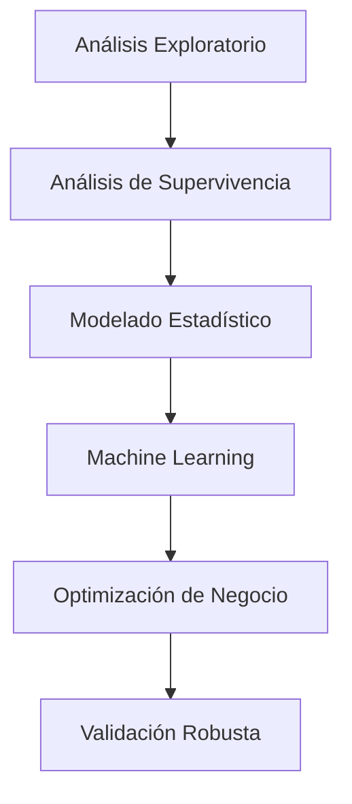

# 📊 Análisis Predictivo de Churn en Telecomunicaciones

## 🎯 Descripción del Proyecto

Este proyecto presenta un análisis completo de predicción de abandono de clientes (churn) para **Telco Company**, una empresa de telecomunicaciones. Utilizando técnicas avanzadas de ciencia de datos, machine learning y análisis estadístico, desarrollamos un modelo predictivo robusto que identifica clientes en riesgo de abandonar el servicio, permitiendo implementar estrategias de retención proactivas y optimizar el ROI de las campañas de marketing.

## 🏢 Caso de Negocio

**Empresa:** Telco Company  
**Sector:** Telecomunicaciones - Servicios de telefonía móvil  
**Problema:** Alta tasa de abandono en segmentos específicos y bajo retorno en campañas generalizadas  
**Objetivo:** Desarrollar un sistema de alerta temprana para intervenciones personalizadas  

### Desafíos Identificados:
- ❌ Alta tasa de abandono de clientes en segmentos específicos
- ❌ Bajo retorno en campañas de retención generalizadas  
- ❌ Pérdida de clientes premium sin señales evidentes de insatisfacción
- ❌ Dificultad para anticipar cuándo un cliente abandonará el servicio

## 🔬 Metodología

### Enfoque Científico Riguroso

El proyecto implementa una metodología integral que combina:



### 1. **División de Datos Estratificada**
- 📊 **70% Training** (40,764 observaciones)
- 🧪 **20% Test** (11,632 observaciones)  
- 🔒 **10% Backtesting** (5,822 observaciones)
- ✅ Estratificación por churn mantenida en todos los conjuntos

### 2. **Análisis de Supervivencia (Kaplan-Meier)**
- 📈 Curvas de supervivencia por grupos de actividad
- ⏱️ Período de observación: 90 días
- 🎯 Identificación de factores de riesgo temporal
- 📊 Modelo Cox Proportional Hazards para análisis avanzado

### 3. **Análisis Estadístico Profundo**
- 📋 Regresión logística con **statsmodels**
- 🔍 Interpretación de coeficientes y odds ratios
- 📊 **Pseudo R² (McFadden): 0.2598**
- ✅ **11 variables estadísticamente significativas** (p < 0.05)

### 4. **Modelado Supervisado Comparativo**
- 🏆 **Random Forest** (Ganador - F1: 0.5703)
- 📊 Regresión Logística (Scikit-Learn)
- 🌳 Árbol de Decisión
- 📈 Comparación exhaustiva de métricas

## 🚀 Resultados Principales

### 🏆 Modelo Seleccionado: Random Forest

| Métrica | Test | Backtesting |
|---------|------|-------------|
| **Accuracy** | 0.8623 | 0.8561 |
| **Precision** | 0.4949 | 0.4784 |
| **Recall** | 0.6728 | 0.6574 |
| **F1-Score** | 0.5703 | 0.5538 |
| **ROC-AUC** | 0.8622 | 0.8590 |

### 💰 Optimización de Negocio

- **Umbral Óptimo:** 0.232 (vs. 0.5 estándar)
- **Ahorro Anual:** $13,900
- **Mejora ROI:** 615%
- **Costo Optimizado:** -$11,640 (beneficio neto)

### 🎯 Efectividad del Targeting

- **Baseline Churn Rate:** 13.6%
- **Decil 1 Churn Rate:** 59.5% (**4.38x lift**)
- **Top 30% captura:** **80.5%** de todos los churners
- **Precisión Decil 1:** 59.5%

## 📁 Estructura del Proyecto

```
churn-analysis/
├── 📓 churn_telco_analysis.ipynb          # Notebook principal completo
├── 📊 data/
│   └── churn_telco_dataset.parquet        # Dataset original
├── 📋 results/
│   ├── model_comparison.csv               # Comparación de modelos
│   ├── feature_importance.csv             # Importancia de variables
│   └── lift_analysis.csv                  # Análisis de lift por deciles
├── 📈 visualizations/
│   ├── survival_curves.png                # Curvas de supervivencia
│   ├── roc_curves.png                     # Curvas ROC comparativas
│   └── lift_chart.png                     # Gráfico de lift
├── 📄 marketing_strategies.md             # Estrategias de marketing
└── 📖 README.md                           # Este archivo
```

## 🛠️ Tecnologías Utilizadas

### Core Data Science
- **Python 3.11+**
- **Pandas** - Manipulación de datos
- **NumPy** - Computación numérica
- **Scikit-learn** - Machine Learning
- **Statsmodels** - Análisis estadístico

### Visualización
- **Matplotlib** - Gráficos base
- **Seaborn** - Visualizaciones estadísticas
- **Plotly** - Gráficos interactivos (opcional)

### Análisis Avanzado
- **Lifelines** - Análisis de supervivencia
- **Imbalanced-learn** - Técnicas de balanceamento (SMOTE)
- **SciPy** - Estadística avanzada

### Entorno
- **Jupyter Notebook** / **Google Colab**
- **Git** - Control de versiones

## 🚀 Instrucciones de Ejecución

### Requisitos Previos

```bash
# Crear entorno virtual
python -m venv churn_env
source churn_env/bin/activate  # En Windows: churn_env\Scripts\activate

# Instalar dependencias
pip install -r requirements.txt
```

### Dependencias Principales

```bash
pip install pandas numpy scikit-learn matplotlib seaborn
pip install statsmodels lifelines imbalanced-learn scipy
pip install jupyter notebook
```

### Ejecución

1. **Clonar el repositorio:**
```bash
git clone https://github.com/username/churn-analysis-telco.git
cd churn-analysis-telco
```

2. **Ejecutar el notebook:**
```bash
jupyter notebook churn_telco_analysis.ipynb
```

3. **Ejecutar todas las celdas** para reproducir el análisis completo

### ⏱️ Tiempo de Ejecución
- **Tiempo estimado:** 15-20 minutos
- **Requerimientos:** 8GB RAM mínimo
- **GPU:** No requerida

## 📊 Variables del Dataset

### 👤 Información del Cliente
- `user_account_id` - Identificador único
- `user_lifetime` - Días como cliente
- `user_account_balance_last` - Balance final del período
- `user_spendings` - Gastos totales
- `user_intake` - Ingresos generados

### 📞 Comportamiento de Llamadas
- `calls_outgoing_count` - Número de llamadas realizadas
- `calls_outgoing_duration` - Duración total de llamadas
- `calls_outgoing_inactive_days` - Días sin realizar llamadas
- `calls_outgoing_to_onnet/offnet/abroad` - Llamadas por destino

### 📱 Comportamiento de SMS
- `sms_outgoing_count` - SMS enviados
- `sms_incoming_count` - SMS recibidos
- `sms_outgoing_inactive_days` - Días sin enviar SMS

### 💳 Comportamiento de Recargas
- `reloads_count` - Número de recargas
- `reloads_inactive_days` - Días sin recargar
- `last_100_reloads_*` - Estadísticas históricas

### 🎯 Variable Objetivo
- `churn` - **1**: Cliente abandonó, **0**: Cliente activo

## 🔍 Insights Clave

### Variables Más Predictivas

| Variable | Efecto | Odds Ratio | Interpretación |
|----------|--------|------------|----------------|
| `calls_outgoing_duration_max` | 🔽 | 0.625 | Llamadas largas → menor churn |
| `user_has_outgoing_sms` | 🔽 | 0.634 | Enviar SMS → menor churn |
| `reloads_inactive_days` | 🔺 | 1.251 | Más días sin recarga → mayor churn |
| `user_has_outgoing_calls` | 🔽 | 0.744 | Hacer llamadas → menor churn |
| `user_lifetime` | 🔺 | 1.102 | Mayor antigüedad → paradójicamente mayor churn |

### Factores de Protección (Reducen Churn)
- ✅ **Actividad reciente** en llamadas y SMS
- ✅ **Duración de llamadas** elevada
- ✅ **Engagement** con servicios
- ✅ **Recargas regulares**

### Factores de Riesgo (Aumentan Churn)
- ⚠️ **Inactividad prolongada** (>2 días)
- ⚠️ **Días sin recargar**
- ⚠️ **Baja interacción** con servicios
- ⚠️ **Antigüedad elevada** (requiere atención especial)

## 📈 Análisis de Supervivencia

### Grupos de Riesgo por Actividad

| Grupo | N Usuarios | Tasa Churn | Mediana Supervivencia |
|-------|------------|------------|----------------------|
| **Alta Actividad** | 24,432 | 0.59% | ∞ días |
| **Baja Actividad** | 16,332 | 1.54% | ∞ días |

### Curvas de Kaplan-Meier
- 📉 **Diferencias significativas** entre grupos de actividad
- ⏰ **Ventana de acción** identificada para prevención
- 🎯 **Targeting temporal** optimizado

## 🎯 Aplicaciones de Negocio

### 1. **Sistema de Alerta Temprana**
```python
if predicted_probability > 0.232:
    trigger_retention_campaign()
    assign_priority_support()
    offer_personalized_incentives()
```

### 2. **Segmentación Inteligente**
- **Decil 1:** Intervención inmediata (lift 4.38x)
- **Deciles 2-3:** Campañas proactivas automatizadas
- **Deciles 4-10:** Mantenimiento y upselling

### 3. **Optimización de Recursos**
- 🎯 **Targeting Preciso:** 30% de esfuerzo captura 80% del churn
- 💰 **ROI Optimizado:** $13,900 ahorro anual demostrado
- ⚡ **Respuesta Rápida:** Alertas automáticas <24 horas

## 🔮 Próximos Pasos

### Mejoras Técnicas
- [ ] **Deep Learning:** Implementar redes neuronales
- [ ] **Feature Engineering:** Variables derivadas temporales
- [ ] **Ensemble Methods:** Combinar múltiples modelos
- [ ] **Real-time Scoring:** API para scoring en vivo

### Expansión de Negocio
- [ ] **Segmentación Geográfica:** Análisis por región
- [ ] **Análisis de Valor:** Incorporar CLV (Customer Lifetime Value)
- [ ] **Modelos Específicos:** Por tipo de plan o demografía
- [ ] **Análisis de Sentimiento:** Social listening integration

### Implementación Operacional
- [ ] **Dashboard Ejecutivo:** Métricas en tiempo real
- [ ] **API de Predicción:** Integración con CRM
- [ ] **A/B Testing Framework:** Validación de estrategias
- [ ] **Automated Reporting:** Informes automatizados

## 👥 Contribuciones

### Cómo Contribuir

1. **Fork** el repositorio
2. **Crear una rama** para tu feature (`git checkout -b feature/AmazingFeature`)
3. **Commit** tus cambios (`git commit -m 'Add some AmazingFeature'`)
4. **Push** a la rama (`git push origin feature/AmazingFeature`)
5. **Abrir un Pull Request**

### Áreas de Contribución
- 🐛 **Bug fixes** y optimizaciones
- 📊 **Nuevas visualizaciones**
- 🤖 **Algoritmos adicionales**
- 📖 **Documentación mejorada**
- 🧪 **Tests y validaciones**

## 📄 Licencia

Este proyecto está bajo la Licencia MIT - ver el archivo [LICENSE.md](LICENSE.md) para detalles.

## 📞 Contacto

**Autor:** Xavier Jácome Piñeiros, MSc.  

## 📚 Referencias

### Papers y Metodología
- Kaplan, E. L., & Meier, P. (1958). Nonparametric estimation from incomplete observations
- Cox, D. R. (1972). Regression models and life-tables
- Chen, T., & Guestrin, C. (2016). XGBoost: A scalable tree boosting system

### Recursos Adicionales
- [Documentación Scikit-learn](https://scikit-learn.org/stable/)
- [Lifelines Documentation](https://lifelines.readthedocs.io/)
- [Statsmodels Documentation](https://www.statsmodels.org/)

---

## 🌟 ¿Te gustó este proyecto?

Si este análisis te resultó útil:
- ⭐ **Dale una estrella** al repositorio
- 🍴 **Fork** para tus propios experimentos  
- 📤 **Comparte** con tu red
- 💬 **Deja comentarios** y sugerencias

---

*"La predicción exitosa del churn no está solo en los algoritmos, sino en la comprensión profunda del comportamiento del cliente y la implementación inteligente de estrategias de retención."*
